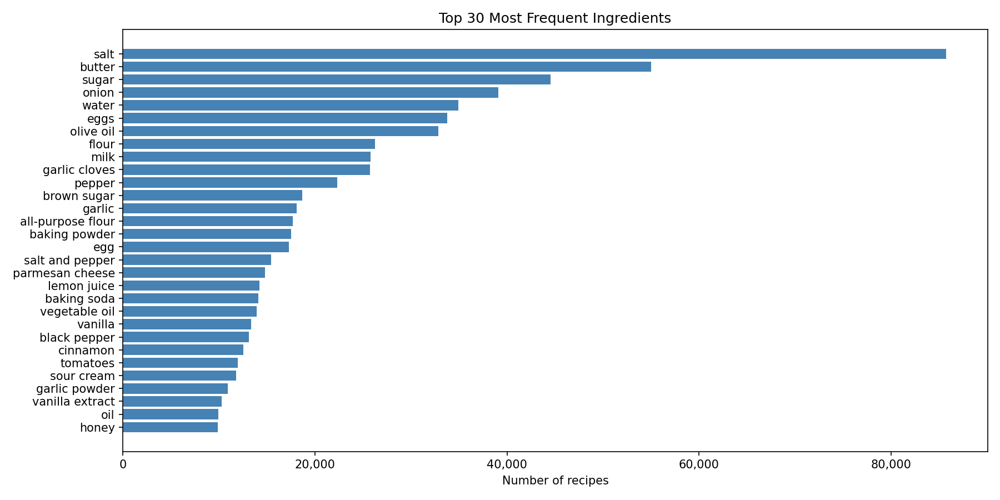
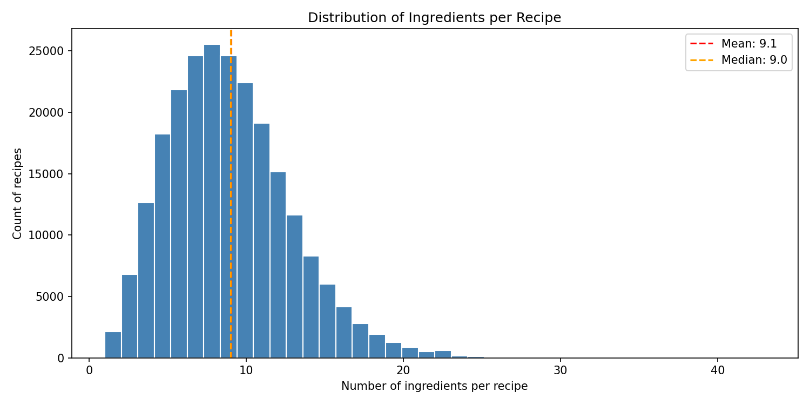
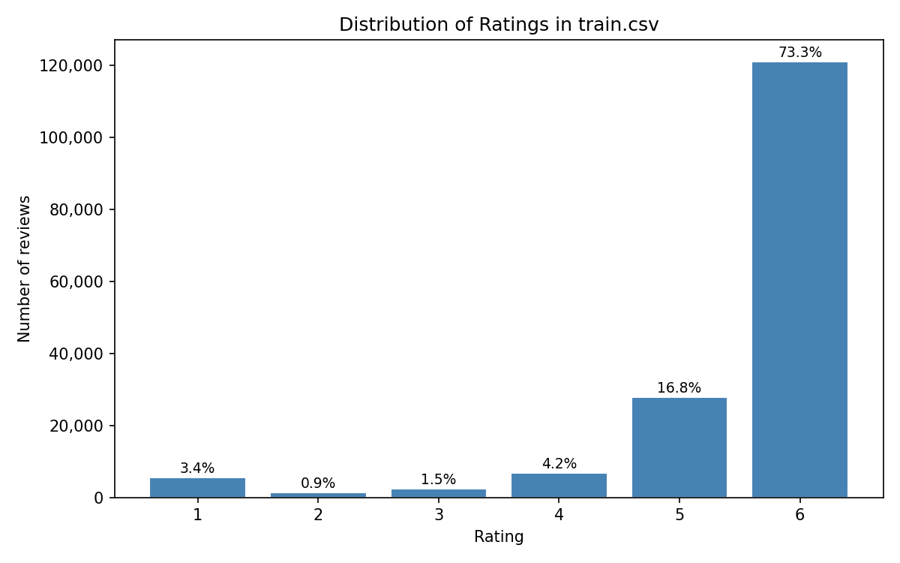
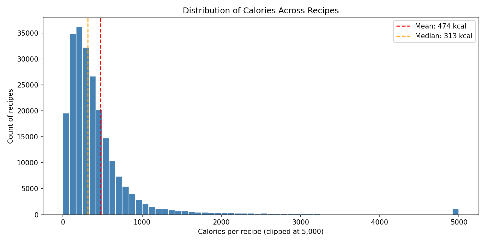
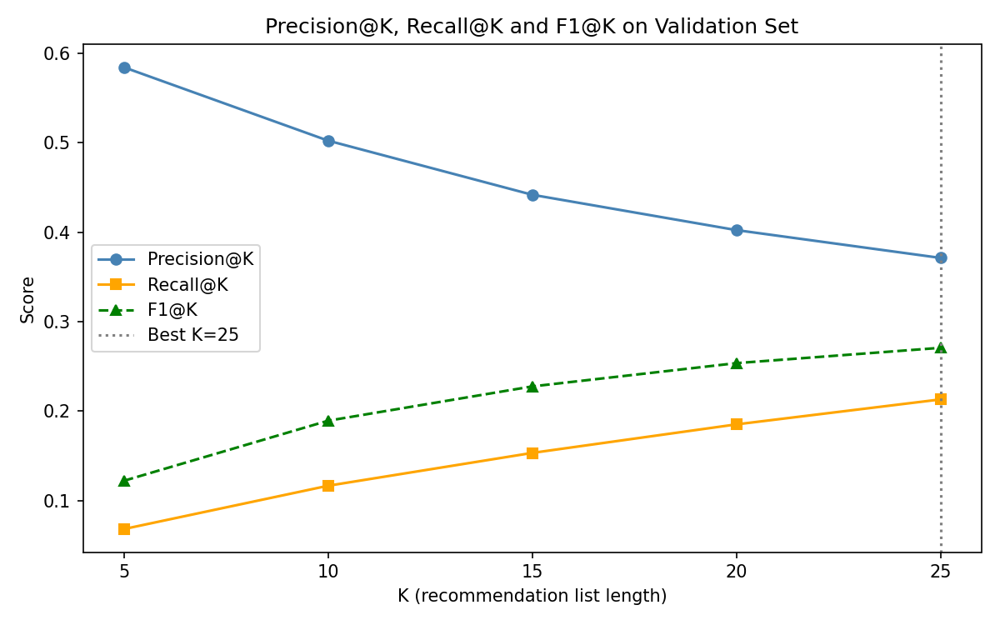
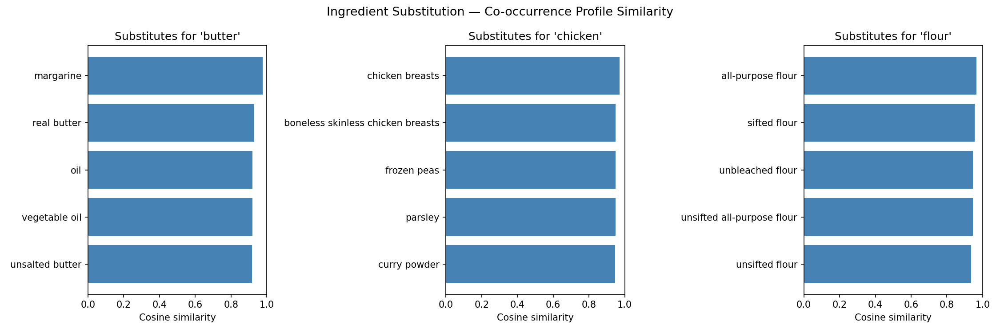
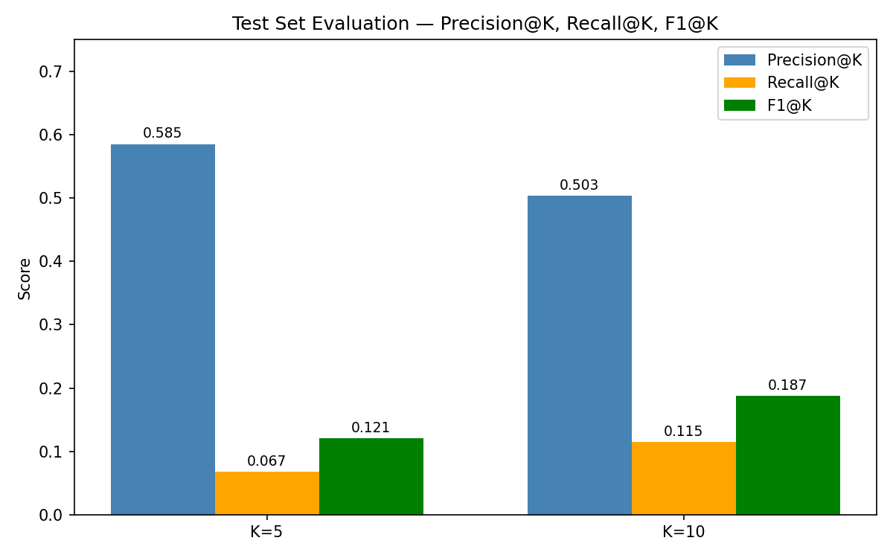
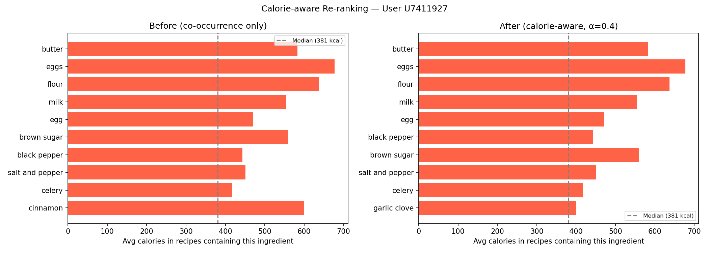

# Ingredient Recommendation System — food.com

---

## Project Overview

food.com hired us as consultants to build a personalised **ingredient recommendation system** on top of their recipe and user-review dataset. Starting from a user's past recipe reviews, the system surfaces the ingredients they are most likely to want next — and goes further by matching recipes to those ingredients and suggesting culinary substitutes.

The system delivers three core capabilities:

1. **Top-N Ingredient Recommendation** — Personalised ingredient lists ranked by co-occurrence relevance, with a global-popularity fallback for sparse users.
2. **Recipe Matching** — Given a personalised ingredient list, retrieve the best-matching recipes from the 231 K-recipe catalogue using overlap count and Jaccard similarity.
3. **Ingredient Substitution** — Suggest the closest culinary alternatives for any ingredient by comparing co-occurrence profile vectors with cosine similarity.

Two optional objectives were also addressed:

- **Coverage & Diversity** — Measuring how broadly the system explores the 14,942-ingredient catalogue and how varied each recommendation list is within itself.
- **Calorie-aware Re-ranking** — Incorporating nutritional data to promote healthier ingredient suggestions without sacrificing relevance.

---

## Table of Contents

1. [Dataset](#dataset)
2. [Exploratory Data Analysis](#exploratory-data-analysis)
3. [Data Preparation & Splitting](#data-preparation--splitting)
4. [Model — Co-occurrence Recommender](#model--co-occurrence-recommender)
5. [Recipe Matching](#recipe-matching)
6. [Ingredient Substitution](#ingredient-substitution)
7. [Evaluation Results](#evaluation-results)
8. [Optional Objectives](#optional-objectives)
9. [Folder Structure](#folder-structure)
10. [How to Run](#how-to-run)
11. [Dependencies](#dependencies)
12. [Limitations & Future Work](#limitations--future-work)

---

## Dataset

| File | Rows | Description |
|------|------|-------------|
| `data/metadata.csv` | 231,637 | Recipe catalogue — ingredients, nutrition, tags, steps |
| `data/train.csv` | 165,226 | User–recipe interactions — user_id, recipe_id, rating (1–6), review, date |

- **11,346** unique users · **62,517** unique recipes reviewed · **14,942** unique ingredients across the catalogue
- Ratings use an unusual 1–6 scale (not the more common 1–5), and are heavily skewed toward the maximum value

> The raw data files are large (~330 MB combined) and are excluded from Git via `.gitignore`. Download them and place them under `data/` before running the notebook.

---

## Exploratory Data Analysis

### Ingredient Frequency



The ingredient space is dominated by pantry staples. **Salt** appears in over 85,000 recipes — more than a third of the entire catalogue — followed by butter (~55 K), sugar (~45 K), and onion (~40 K). The top 10 ingredients alone cover an enormous fraction of all recipes, while the remaining ~14,900 ingredients make up a very long tail.

This distribution has a direct impact on the recommender: a naive popularity-based model would recommend salt and butter to virtually every user, which carries little personalisation value. The co-occurrence approach addresses this by scoring ingredients relative to a user's *specific* history rather than global frequency alone.

---

### Ingredients per Recipe



Most recipes contain between 5 and 15 ingredients, with a mean of ~9.0 and a slight right skew. Each liked recipe therefore contributes roughly 9 implicit ingredient preferences per user — a reasonably rich signal for a cold-start recommender. Recipes with more than 30 ingredients are rare outliers (likely bulk or restaurant-style recipes) and can inflate ingredient frequency counts without providing proportional personalisation signal.

---

### Rating Distribution



The rating scale runs from 1 to 6, and the distribution is strongly right-skewed: **73.3% of all reviews give a rating of 6**, and ratings 5–6 together account for ~90% of all interactions. Ratings 1–3 collectively represent only ~5.8%, clearly marking disliked recipes.

This pattern guided the key design decision of the data pipeline: we define a **"liked" interaction as rating ≥ 4** (capturing 94.2% of all reviews). This threshold includes all genuinely positive signals while excluding the small fraction of negative/neutral interactions. Using a higher threshold (e.g. ≥ 5) would lose the informative rating-4 tier; using ≥ 1 would introduce noise from clearly disliked recipes.

---

### Calorie Distribution



Recipe calories are right-skewed, with a median of ~381 kcal and a long tail extending to tens of thousands (bulk/party recipes). The bulk of recipes fall between 100 and 800 kcal. The median serves as our reference point for the calorie-aware re-ranking objective: ingredients whose associated recipes fall below the median calorie level are considered "healthier" alternatives.

---

## Data Preparation & Splitting

### From Ratings to Ingredient Signals

The raw `train.csv` provides user–recipe interactions, not user–ingredient interactions. We bridge this gap by:

1. Filtering to liked interactions (rating ≥ 4) → **155,745 interactions**
2. Joining each interaction with its recipe's ingredient list from `metadata.csv`
3. Exploding into (user, ingredient) pairs and deduplicating → **1,016,030 unique pairs across 11,337 users**

On average, each user has interacted with **~90 unique ingredients** across their liked recipes — a rich signal for personalised recommendations.

### Train / Validation / Test Split (70 / 15 / 15)

Users are split at the **user level**, not the interaction level. This ensures that all validation and test users are completely unseen during training — the realistic cold-start deployment scenario.

| Split | Users | User–ingredient pairs |
|-------|-------|-----------------------|
| Train | 7,935 (70%) | 711,586 |
| Validation | 1,701 (15%) | 151,315 |
| Test | 1,701 (15%) | 153,129 |

**Ingredient cold-start rate** (ingredients in val/test not seen in training) is ~7% — low enough that the global popularity fallback handles it gracefully.

---

## Model — Co-occurrence Recommender

### How It Works

A global **ingredient co-occurrence matrix** is built from all 231,637 recipes in the metadata:

```
cooccurrence[a][b] = number of recipes where both ingredient a and b appear together
```

To recommend for a user, their known ingredient history acts as a "seed". Every unseen ingredient is scored by summing its co-occurrence counts across all seed ingredients:

```
score(candidate) = Σ cooccurrence[seed_i][candidate]   for each seed_i in user history
```

Candidates are ranked by score. If the co-occurrence signal produces fewer than K candidates, a **global-popularity fallback** fills the remaining slots using the most frequently seen ingredients in the training set.

### Hyperparameter Tuning — Choosing K



We evaluated Precision@K and Recall@K on the 1,701 validation users for K ∈ {5, 10, 15, 20, 25}. For each user, their ingredient list is split 50/50: the first half acts as the seed input, and the second half is the held-out ground truth.

Key observations from the validation tuning:

- **Precision decreases** as K grows (more items recommended → harder to stay precise)
- **Recall increases** as K grows (longer lists cover more of the ground truth)
- **F1@K peaks at K=25** mathematically, but this is because recall has not yet plateaued — users have ~45 held-out ingredients on average, so even K=25 covers less than half the ground truth
- In practice, **K=10 is the recommended operating point**: it delivers Precision ≈ 0.50 (half the list is genuinely relevant) with a reasonable recall of ~0.12, and is compact enough for a real user interface

---

## Recipe Matching

Given a user's Top-K ingredient list, the system retrieves the recipes that best match those ingredients. Each recipe is scored by:

- **Overlap count** — how many of the recommended ingredients appear in the recipe
- **Jaccard similarity** — overlap / union, normalising for recipe length

Recipes are ranked first by overlap count, then by Jaccard to break ties between short and long recipes.

**Example — Top-10 ingredients for User U6440549:**

> `milk · all-purpose flour · vanilla · vegetable oil · cinnamon · garlic clove · chicken broth · worcestershire sauce · parsley · unsalted butter`

Top matching recipes (5 matches each on overlap count):

| Recipe | Overlap | Jaccard | Calories |
|--------|---------|---------|----------|
| blue jimmy pillows | 5 | 0.312 | 462 kcal |
| the best apple pie muffins ever | 5 | 0.312 | 276 kcal |
| quick oat bran and banana muffins | 5 | 0.312 | 179 kcal |
| blueberry fritters | 5 | 0.312 | 77 kcal |
| chicken fried steak and gravy | 5 | 0.312 | 119 kcal |

The matched recipes span both savoury (chicken broth / worcestershire sauce) and sweet (vanilla / cinnamon) directions, reflecting the mixed nature of this user's ingredient list.

---

## Ingredient Substitution



Each ingredient is represented as a **co-occurrence profile vector** — a sparse vector recording how often it appears alongside every other ingredient across all recipes. Two ingredients that are used in similar culinary contexts will develop similar profiles.

Substitutes are ranked by **cosine similarity** between these vectors:

| Query | Top substitutes | Similarity |
|-------|----------------|-----------|
| `butter` | margarine, real butter, oil, vegetable oil, unsalted butter | 0.977 – 0.918 |
| `chicken` | chicken breasts, boneless skinless chicken breasts | 0.971 – 0.949 |
| `flour` | all-purpose flour, sifted flour, unbleached flour | 0.964 – 0.936 |

The results are culinarily sensible: fats substitute for fats, chicken cuts for chicken cuts, and flour variants for flour variants. The main limitation is that the method cannot distinguish between true *substitutes* and *complements* — both tend to co-occur with the same ingredients. Adding ingredient-category metadata (fats, proteins, starches) would improve precision.

---

## Evaluation Results

### Test Set Metrics



Final evaluation on the **1,701 held-out test users** (100% cold-start — never seen during training):

| Metric | K=5 | K=10 |
|--------|-----|------|
| **Precision@K** | **0.585** | **0.503** |
| **Recall@K** | 0.067 | 0.115 |
| **F1@K** | 0.121 | 0.187 |

**Precision@10 = 0.50** means that, on average, 5 out of every 10 recommended ingredients are genuinely in the user's held-out ingredient set — strong performance for a cold-start problem where the model has never encountered the test users.

Recall is lower because each user's ground-truth ingredient set is large (~45 ingredients on average), and a list of 10 recommendations can only cover a small fraction of that space. This is an inherent precision–recall trade-off in Top-N systems with a large item catalogue.

**Consistency check:** Test results (P@10 = 0.503, R@10 = 0.115) match validation results (P@10 = 0.502, R@10 = 0.117) almost exactly, confirming the model generalises consistently and has not overfit to the validation split.

---

## Optional Objectives

### Coverage & Diversity

| Metric | Value |
|--------|-------|
| Catalogue coverage (K=10) | 0.27% (41 / 14,942 ingredients) |
| Avg within-list diversity | 0.25 (1 − cosine similarity) |

**Coverage** is very low: only ~41 unique ingredients ever appear across all 1,701 users' Top-10 lists. This reflects a strong **popularity bias** — the co-occurrence model consistently recommends the same high-frequency pantry staples regardless of user history. Long-tail ingredients (niche, regional, or seasonal items) are almost never surfaced.

**Diversity** within a single user's list averages 0.25 on the 0–1 dissimilarity scale. This is moderate — recommendations are not all identical, but they tend to cluster around similar culinary roles (baking staples together, aromatics together). A diversity-forcing mechanism like Maximum Marginal Relevance would increase both metrics.

### Calorie-aware Re-ranking



For the optional health objective, each ingredient is assigned an *average calorie load* — the mean calorie content of all recipes in the catalogue that contain it. Candidates are re-ranked using:

```
final_score = normalised_cooccurrence_score − α × normalised_calorie_score
```

With α = 0.4, the re-ranking promotes lower-calorie ingredients without fully overriding relevance. In the example above (User U7411927), `cinnamon` (599 avg kcal) is swapped out in favour of `garlic clove` (400 avg kcal), reducing the average calorie load of the list by **~20 kcal**.

The trade-off is transparent: higher α values produce healthier lists at the cost of lower Precision@K. In a production system, α could be user-configurable as a "healthy mode" preference slider.

---

## Folder Structure

```
ingredient-recommendation/
│
├── README.md                   ← You are here
├── .gitignore
├── requirements.txt
│
├── notebook/
│   ├── group_submission.ipynb  ← Full end-to-end analysis (8 sections)
│   └── README.md
│
├── data/
│   ├── metadata.csv            ← Not tracked by Git (too large)
│   ├── train.csv               ← Not tracked by Git (too large)
│   └── README.md               ← Full data dictionary
│
├── outputs/
│   ├── charts/                 ← All 9 plots generated by the notebook
│   └── README.md
│
└── slides/
    ├── Slide.pdf               ← Project presentation (16 slides)
```

---

## How to Run

### 1. Clone the repository

```bash
git clone https://github.com/<your-username>/ingredient-recommendation.git
cd ingredient-recommendation
```

### 2. Set up the environment

```bash
conda create -n rec_system python=3.10
conda activate rec_system
pip install -r requirements.txt
```

### 3. Add the data files

Place `metadata.csv` and `train.csv` into the `data/` folder.

### 4. Run the notebook

Always launch Jupyter **from the project root** so relative paths resolve correctly:

```bash
jupyter notebook notebook/group_submission.ipynb
```

Then: **Kernel → Restart & Run All**. Charts are saved to `outputs/charts/` automatically.

---

## Dependencies

| Library | Version | Purpose |
|---------|---------|---------|
| pandas | ≥1.5, <2.0 | Data manipulation |
| numpy | <2.0 | Numerical operations |
| scikit-learn | ≥1.0 | Train/val/test split |
| matplotlib | ≥3.5 | Visualisation |
| seaborn | ≥0.11 | Visualisation |
| jupyter | ≥1.0 | Notebook environment |

---

## Limitations & Future Work

**Current limitations:**

- **Popularity bias** — Only ~0.27% of the ingredient catalogue is ever recommended; the model gravitates toward universal pantry staples for most users.
- **Cold-start personalisation ceiling** — Since all test users are cold-start, recommendations rely on population-level co-occurrence rather than individual preference, limiting personalisation for users with unusual tastes.
- **Substitution ambiguity** — The cosine similarity method conflates complements (butter + sugar) with substitutes; ingredient-category metadata would sharpen the distinction.
- **Calorie proxy** — Calorie scores reflect the surrounding dish, not the ingredient's own caloric value, which can unfairly penalise ingredients that happen to appear in rich recipes.

**Future directions:**

- Implement matrix factorisation (SVD, ALS) or neural collaborative filtering for richer latent representations
- Add diversity-forcing with Maximum Marginal Relevance to improve catalogue coverage
- Incorporate ingredient category metadata for more accurate substitution
- Extend the health score to all nutrition dimensions (protein, sodium, fat, sugar)
- Use temporal train/test splits for a more realistic deployment evaluation
